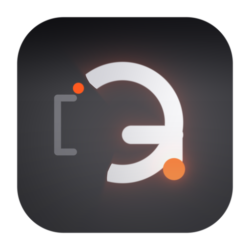
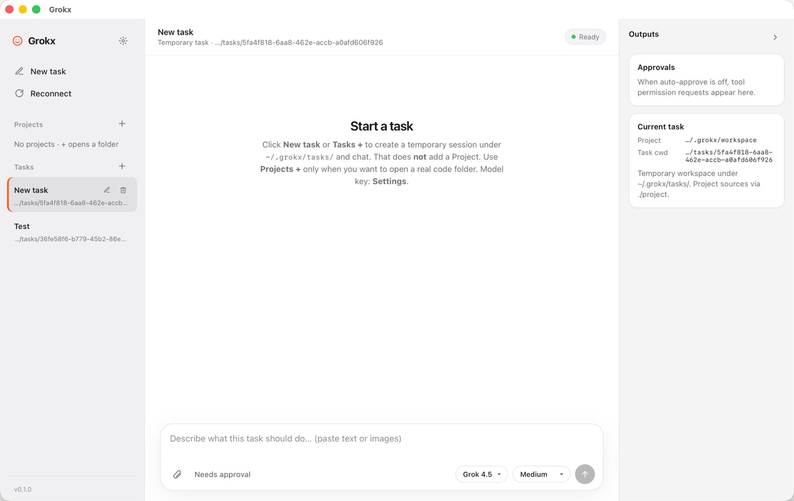
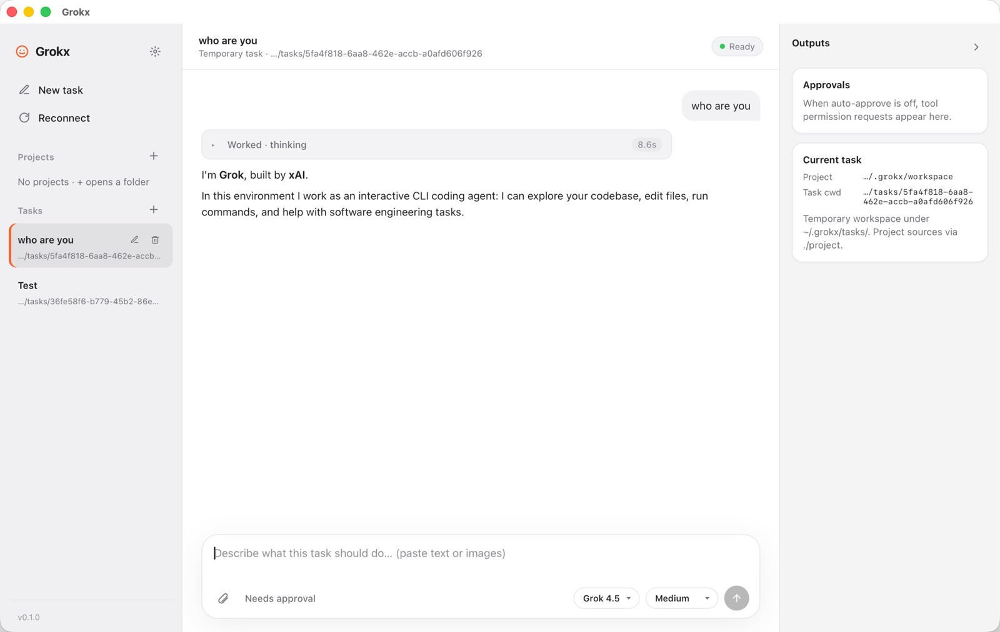

# Grokx

<p align="center">
  
</p>

<p align="center">
  <strong>Open-source desktop AI coding app</strong><br />
  Codex-style light UI · bundled Grok Build engine · Tauri + React
</p>

<p align="center">
  <a href="https://github.com/tangf-ai/grokx"></a>
  
  
</p>

---

**Grokx** wraps a fully bundled, thin-forked [Grok Build](https://github.com/xai-org/grok-build) engine behind a clean desktop shell.

| Layer | Stack |
|-------|--------|
| **App** | Tauri 2 + Rust core + React UI |
| **Engine** | Grok Build via `git subtree` (`engine/grok-build`) |
| **Boundary** | ACP over `grok agent stdio` (process isolation) |

## Screenshots

### Workspace

Projects, tasks (rename / delete), empty chat ready for a new prompt.



### Chat

User prompt, collapsible thinking trace with duration, final assistant reply.



<p align="center">
  
</p>

## Features

- Light Codex-style UI: projects, tasks, chat, sticky user prompts
- **New task** without picking a folder (default sandbox `~/.grokx/workspace`)
- Per-task workspace under `~/.grokx/tasks/<id>` with `project` symlink for source access
- Attachments, **clipboard paste** (text + images), model picker, reasoning effort
- Collapsible thinking / tool traces with duration after each turn
- Permission approvals (park until Allow / Deny)
- Settings for API base URL, key, model, and engine path
- Task rename / delete; list order stays by creation time
- Chat + task list persistence across app restarts
- Bundled runtime resolution (prefer `resources/runtime/grok` over PATH)

## Repository layout

```text
apps/desktop          # Tauri desktop shell + UI
crates/               # Product Rust libraries (domain, ACP, process, permissions…)
engine/grok-build     # Thin fork of xai-org/grok-build (subtree)
packaging/            # Bundle / sign / notarize helpers
tools/                # Dev + upstream sync scripts
docs/                 # Architecture, images, contribution policy
```

See [docs/repo-structure.md](docs/repo-structure.md) and [docs/engine-policy.md](docs/engine-policy.md).

## Prerequisites

- Rust stable (`rustup`)
- Node.js 20+ and pnpm (for the desktop UI)
- Platform build tools for Tauri (see [Tauri prerequisites](https://v2.tauri.app/start/prerequisites/))
- Optional: a working `grok` CLI for PATH fallback during development

## Quick start

```bash
git clone git@github.com:tangf-ai/grokx.git
cd grokx

# Product crate tests
cargo test -p domain -p acp-bridge -p agent-process -p app-core \
  -p app-config -p permissions -p session-store

# Desktop app
cd apps/desktop
pnpm install
pnpm tauri dev
```

### Desktop flow

1. Open **Settings** (gear) and set model **Base URL** / **API Key** (optional if `~/.grok` already works).
2. Click **New task** (or **Tasks +**) to create a temporary task and start chatting.
3. Optional: **Projects +** to open a real code folder; new tasks under that project use its path via `./project`.
4. Paste text/images into the composer, pick model / effort, approve tools when needed.
5. Rename (✎) or delete (🗑) tasks from the sidebar; reopen the app to resume history.

### Bundle engine runtime (optional)

```bash
# From repo root — build from subtree when possible:
./tools/build-engine.sh && ./packaging/bundle_runtime.sh

# Or place a grok binary into runtime-dist/ then:
./packaging/bundle_runtime.sh
```

The packaged binary is **not** committed; local builds write to `apps/desktop/src-tauri/resources/runtime/grok` (gitignored).

## Engine strategy

| Item | Choice |
|------|--------|
| Bundle | Installers can ship a pinned Grok Build runtime |
| Source | `engine/grok-build` via **git subtree** |
| Coupling | App talks to engine over ACP stdio |
| Overrides | Settings may point at a custom `grok` binary |
| Upstream | Periodic merge from `https://github.com/xai-org/grok-build` |

```bash
./tools/sync-upstream.sh
```

## License

- Product code: Apache-2.0 (see `LICENSE`)
- Engine: Apache-2.0 from upstream Grok Build (see `engine/grok-build/LICENSE` and `NOTICE`)

## Security notes

- Do not commit API keys. App settings live outside the repo (e.g. Application Support).
- Optional sync writes model config into `~/.grok/config.toml` on your machine only.
- Task data lives under `~/.grokx/tasks/` on your machine.
